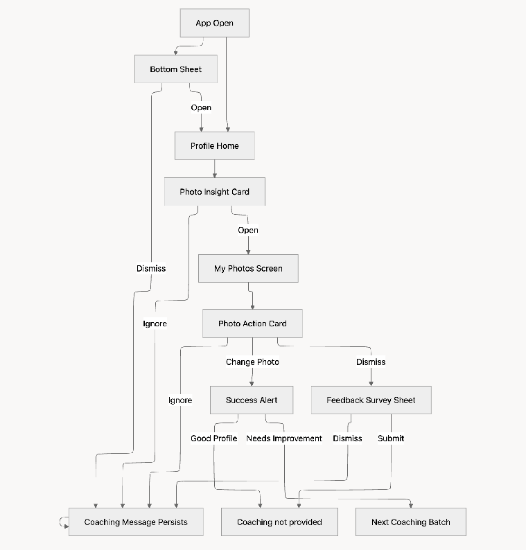

| Key           | Value                                                                                    |
| ------------- | ---------------------------------------------------------------------------------------- |
| Source        | https://docs.google.com/document/d/1Q4x0DwGJuDGjTaqFAtlbHFH-KD1cWZosPI-zdhFTQ9U/edit?tab=t.zbd36zecf8rg |
| Downloaded at | 2026-04-22 10:20:54 |

---

# Serving Options

Maintainer [Juniper Han](mailto:juniper.han@match.com) [Brandon Choi](mailto:brandon.choi@match.com)  
Reviewer [Mumu Kim](mailto:mumu.kim@match.com)  
Last updated 2026-04-15  
---

[About this document](#about-this-document)

[Cost Dashboard](#heading=h.e52by4wh8l9)

[Summary](#heading=h.wf38ei3d67j2)

[Constraints](#heading=h.xehxwgb5x9me)

[Options](#options-in-one-table)

[Remaining Questions](#heading=h.733hmlwd1p9q)

---

# About this document {#about-this-document}

We are currently evaluating serving cost optimization approaches for Photo Coaching, with a focus on batching as the leading direction. While batching appears to be more efficient from a cost perspective than real-time baseline, there are open questions- particularly around test plan alignment and engineering feasibility- that require further confirmation. This decision not only affects technical part, but also affects product 

This document outlines the key options & trade-offs, assumptions, and a set of open questions to be addressed in order to build confidence in the proposed approach.

# Flow diagram

- [ ] [Brandon Choi](mailto:brandon.choi@match.com)

# Options in one table {#options-in-one-table}

- [ ] [Juniper Han](mailto:juniper.han@match.com) **WIP**

|  | Option 1 | Option 2 | Option 3 (deprecated) |
| :---- | :---- | :---- | :---- |
| **Approach Explained** | Gemini Batch API (Hourly Batch Precompute) Compute coaching results ahead of time for a selected (eligible) user cohort via batch jobs. Experience is instant, but availability is non-deterministic | Gemini API; Async real-time generation (\~1 min) Start generating results only when triggered at runtime  | True Realtime Generated on-demand with shortest generation time |
| **Ideal trigger** | None (Scheduled hourly batch) | App-open | App-open |
| **Latency to result** | 0.1s or unavailable | Approx. 30\~60 seconds (pre-optimization) | 0 \~ 5 seconds (post-optimization) |
| **Nudge to Profile Home** | Eligible user immediately gets the bottom sheet alert once they enter the app | Eligible user gets the bottom sheet once the coaching message is ready while they are active on the app | Eligible user almost immediately gets the bottom sheet alert once they enter the app |
| **Notification timing** | Immediate (but only if results exists) Those who creates new profile or changes profile picture while batch job is processing will not get coaching and will have to wait until they become eligible in the next batch) | Delayed (up to 1 minute after app enter) | Immediate and the most consistent |
| **Dependency** | **Batch Processing Infra:** Requires batch pipeline, scheduler, and storage for precomputed results **Batch Completion SLA:** A reliable and predictable batch processing window (e.g., current assumption is 1–2h English-only region / \~5h global) is required to ensure sufficient result availability at user entry  **Gemini Batch Processing Capability**: The system depends on Gemini supporting large-scale batch inference with stable throughput and no significant stalling or throttling. | Challenges with Bottom Sheet Trigger Timing and Performance **Disruptive Timing:** Showing the bottom sheet mid-swipe or during another user action feels disruptive and often leads to the user ignoring it. **Short Session Length:** For users with very short average app session durations (less than a minute), the current trigger won't activate. In these instances, the bottom sheet should be considered for immediate display upon the user's next app entrance. **Model Efficiency:** Need to make sure the performance of the lighter model (Gemini flash light) mirrors that of Gemini Pro, for cost and latency reduction | Challenges with ML model and LLM model Performance: **ML Model performance yet to be confirmed**: Only possible if ML model output is viable- its performance must mirror that of Gemini Pro, as demonstrated in the web demo. This is currently scheduled to be evaluated in evaluation iteration 4, in the week of 4/20. **Model Efficiency**: Additionally, optimization of the LLM layer is required to strictly meet the maximum 5-second latency target.  |
| **UX consistency** | Hit or miss | Consistent but much slower | Most consistent and the fastest |
| **Cost** |  |  |  |
| **Pros Summary** | Zero latency at access time (instant UX when available) Most cost-efficient at scale (batch \+ no real-time infra pressure) Enables proactive surfacing without waiting | Less wasted computation w Always fresh results (no staleness issues) | Best user experience (immediate, consistent, in-flow) Highest UX consistency across all users Always fresh results (no staleness issues) |
| **Cons Summary** | Non-deterministic availability The most wasted compute on users who might never view results  | Noticeable latency breaks user flow; and may reduce engagement  | Technically most challenging Higher infra and serving cost |
| **Engineering  decision required** | (Eng) Result availability depends entirely on whether batch processing completes before user access. Requires a clearly defined and validated batch SLA. The current estimate is broad and needs tighter validation.  (Eng) Gemini Batch Throughput & Limits: Uncertainty around actual batch throughput. Requires confirmation with Gemini team on realistic processing rates and scaling reliability based on prior concerns (e.g., NanoBanana QPS limitations) (Eng) Requires backend decision on how to handle: Users missed in batch Newly eligible users mid-cycle Partial batch failures | Real-time Latency Validation (Critical): Need to confirm actual end-to-end latency (P50/P90/P95), not just estimates (\~30–60s). This directly impacts UX viability. Gemini Throughput & QPS Limits: Unclear whether Gemini can reliably support required real-time QPS. Prior issues (e.g., NanoBanana struggling at 1 QPS) raise concerns- needs validation with the Gemini team. | Can the system consistently meet the 0–5 second end-to-end latency target (not just model inference, but full pipeline)? Requires benchmarking Scalability Under Real-time Load: Can the system sustain required QPS while maintaining strict latency SLAs? Needs validation given prior concerns around model/provider scaling limits. Cost at Scale: Real-time serving may increase cost due to always-on inference (need to validate whether it can stay within budget at target traffic) |
| **Product decision required** | (Product/Data) Defined criteria for selecting which users are included in batch processing to ensure meaningful coverage. (Data) We are currently assuming that users who create a new profile or update photos during batch processing (and therefore miss the current batch) represent a negligible portion of the population. Requires data validation to confirm the size of this segment and assess UX impact.  |  |  |
| **Suggestion** |  |  |  |
| **Caveat: we can’t move forward with this option if** | If batch jobs stall, throttle, or cannot scale to required volume | Gemini cannot support required QPS reliably & Delayed notification is too disruptive to engage users at all | The ML model performance is far below that of Gemini Pro & Cost exceeds budget at MVP scale |

# Remaining product questions

- [ ] [Juniper Han](mailto:juniper.han@match.com)

| Questions | Status | Note |
| :---- | :---- | :---- |
| **Related to cost or coaching serving logic** |  |  |
| What was the adoption rate used in the estimation? 20%? | Open |  |
| For people who did **not** change their profile photo, do we want to leave the same coaching message on until they dismiss/ take an action **OR** do we want to be switching to a different lever message until they dismiss coaching? | Open |  |
| For people who changed their profile photo, what would be the cut-off time for profile updates to be included in the next round of coaching? (Assuming this would be low activity hour) | Open |  |
| **Others** |  |  |
| **True or False:** Photo Coaching bottom sheet will only appear on Day 0\. Once the user sees it (whether dismiss or accept), it will never appear again. | Open |  |
|  | Open |  |

# Engineering evidences

## Gemini batch API behavior

- [ ] [Brandon Choi](mailto:brandon.choi@match.com)

## Qwen3-VL performance

- [ ] [Brandon Choi](mailto:brandon.choi@match.com)

## Cost savings effect of Qwen3-VL

- [ ] [Brandon Choi](mailto:brandon.choi@match.com)
