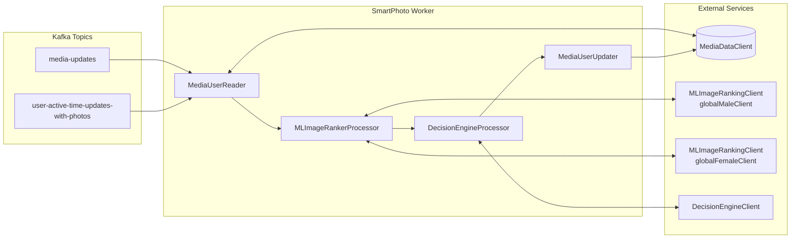

# SmartPhoto V4 — Engineering Report

> **Sources:**
> - [Men's Smart Photo v4 (Confluence, SOUP)](https://gotinder.atlassian.net/wiki/spaces/SOUP/pages/1333133359) — Requirements doc
> - [Smart Photo Service (Confluence, ENG)](https://gotinder.atlassian.net/wiki/spaces/ENG/pages/27947519) — V2/V3 architecture
> - [smartphotosvllm Runbook (GitHub)](https://github.com/TinderBackend/revive.mlinfra/blob/main/service/smartphotosvllm/Runbook.md) — vLLM service
> - [SmartPhoto Worker Runbook (GitHub)](https://github.com/TinderBackend/revive.discovery/blob/main/worker/smartphoto/RUNBOOK.md) — Worker architecture
> - [PR #2175 — Smart Photos V4 LLM Interface and Ranking](https://github.com/TinderBackend/revive.mlinfra/pull/2175) — Decision Engine ranking module
> - [PR #989 — Migrate smartphoto-backfill to Spring Kafka](https://github.com/TinderBackend/revive.discovery/pull/989) — Backfill worker rewrite
> - [PR #925 — Kafka fetch smoothing](https://github.com/TinderBackend/revive.discovery/pull/925) — Traffic burst mitigation
> - [PR #907 — Country expansion](https://github.com/TinderBackend/revive.discovery/pull/907) — Global rollout
> - [ML-1307 (Jira, Tinder)](https://gotinder.atlassian.net/browse/ML-1307) — Epic: SmartPhoto V4 and FU enhancement of Decision Engine
> - [LP-309 (Jira, Hyperconnect)](https://hyperconnect.atlassian.net/browse/LP-309) — Cost-per-inference analysis
> - Slack #smart-photos-v4: backfill ramp, code freeze discussion, DE errors, country expansion, Kafka lag
> - Slack #ml-team-mlinfra: DynamoDB caching deployment (Ankush, Dec 2025)
> - Slack #mgai-aura: GPU cost context, Trideep on SmartPhoto v4 infra
> - Source code: `revive.mlinfra/mlplatform/decisionengine/ranking/smart_photos_ranking/` (Go) — ranking logic, LLM calls, prompt, preprocessing, traffic split
> - Source code: `revive.discovery/worker/smartphoto/` and `worker/smartphoto-backfill/` (Java) — workers, orchestrator

**Changes from v1:**
- Added finding 2.9: dual serving backend (Predibase + vLLM) with traffic split
- Added finding 2.10: profile-aware prompting (age, country, relationship goal, gender preference)
- Added finding 2.11: V4 ranking is male-only
- Added finding 2.12: orchestrator pipeline architecture from worker runbook
- Updated Evidence 3.1 with mermaid diagram from runbook
- Added Evidence 3.9: prompt design details from code
- Added Evidence 3.10: traffic split mechanism from code
- Added Evidence 3.11: profile preprocessing features from code
- Updated Reference with full file inventory from GitHub

---

## 1. Conclusion

**Q: What is the full engineering picture of SmartPhoto v4 — architecture, ML pipeline, infrastructure, key decisions, and team roles?**

SmartPhoto v4 replaces the 2020-era EfficientNet image ranker (v3) with a VLM-based pairwise photo comparator built on Qwen2.5-VL 7B. The system has four main engineering components: (1) two Kafka-driven Java workers that detect photo changes and trigger ranking, (2) a Go Decision Engine that orchestrates pairwise comparisons with DynamoDB caching and profile-aware prompting, (3) a dual serving backend (Predibase hosted + self-hosted vLLM) with etcd-controlled traffic split, and (4) a Phoenix-based experimentation layer. V4 ranking currently applies to male users only. The project was built across two repos (`revive.discovery` for workers, `revive.mlinfra` for ML infra), involved 6 engineers across 4 functions, and rolled out globally between Dec 2025 and Mar 2026.

---

## 2. Key Findings

### 2.1. The system has four core components with clear ownership boundaries

The architecture splits into workers (Java, Gabriela), Decision Engine + vLLM (Go/Python, Ankush + Trideep/Skanda), and experimentation (Phoenix, Kevin). See Evidence 3.1 for the full data flow.

### 2.2. The ML model is a Qwen2.5-VL 7B VLM doing pairwise photo comparison

Instead of scoring each photo independently (v3 approach), v4 receives image pairs and returns which is the better Tinder primary photo. The model runs on vLLM with prefix caching enabled and a custom Qwen2-VL chat template. See Evidence 3.2 for performance numbers.

### 2.3. DynamoDB caching was the key cost optimization

Before caching, every photo event recomputed all pairwise scores for a user's photos (up to 9 photos = 36 pairs). Ankush added a DynamoDB caching layer (Dec 2025) that reuses previously computed pairwise scores when only one photo changes, yielding 30-40% GPU savings (~$20K/month). See Evidence 3.3 for the caching design.

### 2.4. Backfill was the critical-path prerequisite for experiment launch

V4 cannot run an experiment until enough users have precomputed v4 scores. The backfill worker consumed `user-active-time-updates-with-photos` from Kafka and processed existing users over a 2-4 week period. The team ran backfill during the Dec 2025 holiday code freeze to start the experiment in Jan 2026. At 100% backfill, the system ran at ~100 LLM QPS on 70 GPUs (capacity: ~350 QPS). See Evidence 3.4.

### 2.5. Country-based progressive rollout was used for global expansion

Base countries (US, CA, VN, MX, GB) were unconditionally allowed. Two expansion waves added 26 more countries behind independent etcd flags: expansion 1 (AR, AU, CL, PH, TW, VE, DZ, AE, BO, GT) and expansion 2 (IN, NZ, QA, KH, HN, LB, IQ, MN, NP, UG, NI, TT, SN, MU, MD, MM). Each wave could be ramped independently. See Evidence 3.5.

### 2.6. The experiment tested four variants on the swipee side

Control (V3), Variant 1 (V4), Variant 2 (V4 + Shirtless downranking), and Variant 3 (User ordering). A separate swiper-side test added a V4 + Faces variant. The shirtless heuristic uses an existing T&S model to identify and deprioritize the highest-ranked shirtless photo. See Evidence 3.6.

### 2.7. Two significant operational incidents occurred during rollout

(1) Feb 2026: Decision Engine failure rate spiked to ~43%, requiring backfill and additional country traffic to be shut off. (2) Apr 2026: Kafka consumer lag reached 1.38M messages with a growing gap of ~169 msgs/sec, prompting partition increase to 38 for the smartphoto worker. See Evidence 3.7.

### 2.8. The Decision Engine supports dual serving backends with traffic split

The ranking module routes LLM calls to either Predibase (hosted, original) or self-hosted vLLM. The split is controlled by an etcd flag (`SMART_PHOTOS_VLLM_TRAFFIC_RATE`, 0-100%). Within each model request, uncached pairwise comparisons run in parallel, but multiple model IDs are processed sequentially to avoid overwhelming the LLM service. See Evidence 3.10.

### 2.9. Prompts include profile features for personalized ranking

The LLM prompt includes user profile context — age (bucketed), country, match gender preference, and relationship goal — so the model can judge photos relative to the user's audience. Cache is invalidated when target genders or relationship intent change. See Evidence 3.11.

### 2.10. V4 ranking is male-only

The Decision Engine processor is only called for male users (gender 0). Female users continue on V3 (ML Image Ranking with separate male/female EfficientNet models). The worker runbook states: "DecisionEngineProcessor is only called for male users when enabled."

### 2.11. The worker uses a four-stage orchestrator pipeline

Both workers share a `smartphoto-orchestrator` library with four processors in sequence: MediaUserReader → MLImageRankerProcessor → DecisionEngineProcessor → MediaUserUpdater. See Evidence 3.12.

### 2.12. Team structure

Six engineers across four functions worked on v4. See Evidence 3.8 for the full roster and role mapping.

---

## 3. Evidence / Details

### 3.1. System data flow

Within the Decision Engine, the ranking flow for each request:

1. DynamoDB cache fetch and S3 image downloads run **in parallel** (DynamoDB has a 3s timeout — if exceeded, cache is skipped gracefully)
2. Profile features are preprocessed while waiting
3. For each model ID (processed sequentially): determine cached vs uncached pairs, run uncached pairs through LLM **in parallel**, combine results, run Ranker aggregation
4. Save updated cache to DynamoDB asynchronously (5s timeout, background context)
5. Return ranked photo ordering

### 3.2. vLLM service specifications

| Parameter | Value |
|-----------|-------|
| Model | Qwen2.5-VL 7B (fine-tuned) |
| Serving engine | vLLM with prefix caching |
| Tensor parallel size | 2 GPUs per replica |
| GPU type | A10G (or equivalent) |
| Prod pods | 12-59 (scaled over time) |
| Total GPUs in production | Up to 70 |
| LLM QPS capacity | ~350 |
| Accuracy | 76.26% |
| Throughput | 8.50 req/s per replica (2 GPUs, 20 concurrent) |
| Avg latency | 940 ms |
| Chat template | Custom Qwen2-VL jinja template |
| Model weights path | /spotlight/smart_photos_v4_merged |

### 3.3. DynamoDB caching design

- Table: `smartphotoranking`
- Key: user-level; stores pairwise photo scores
- Max photos per user: 9 (max 36 pairwise comparisons)
- On photo event: read existing scores, recompute only new/changed pairs, write back
- GPU savings: 30-40% reduction in LLM calls
- Cost savings: ~$20K/month in GPU costs
- Deployed during Dec 2025 code freeze with exception approval

### 3.4. Backfill timeline

| Date | Event |
|------|-------|
| Dec 19, 2025 | Code freeze exception approved for backfill levers |
| Dec 23, 2025 | DynamoDB caching layer deployed |
| Jan 5, 2026 | Backfill at ~45% capacity, ramping to 100% |
| Jan 5, 2026 | LLM QPS at ~40, stable on 70 GPUs |
| Jan 21, 2026 | Target experiment start (after backfill complete) |
| Feb 10, 2026 | DE failure spike, backfill paused |
| Mar 2026 | Global rollout in progress |

### 3.5. Rollout etcd flags

| Flag | Purpose |
|------|---------|
| smartphoto_decision_engine_enabled | Master switch for v4 ranking |
| smartphoto_decision_engine_country_filter_enabled | Restrict v4 to allowed countries |
| smartphoto_worker_backfill_active_time_process_enabled | Enable backfill worker |
| smartphoto_worker_backfill_country_filter_enabled | Country filter for backfill |
| smartphoto_decision_engine_country_filter_photo_touchup_expansion | Expansion wave 1 (10 countries) |
| smartphoto_decision_engine_country_filter_photo_touchup_expansion_2 | Expansion wave 2 (16 countries) |

### 3.6. Experiment variants

Swipee-side test:

| Variant | Description |
|---------|-------------|
| Control | Smart Photo V3 (EfficientNet, no face prioritization) |
| Variant 1 | Smart Photo V4 (VLM ranking) |
| Variant 2 | V4 + Shirtless (VLM + T&S shirtless downranking) |
| Variant 3 | User ordering (user-set photo order) |

Swiper-side test (additional):

| Variant | Description |
|---------|-------------|
| Variant 4 | V4 + Faces (VLM + T&S face detection prioritization) |

Shirtless heuristic: order photos by v4 score, then swap the first non-shirtless photo into slot 1.

### 3.7. Incidents

**Feb 10, 2026 — Decision Engine failure spike**
- Failure rate: ~43% of DE requests
- Cause: cluster update on Predibase, near-zero LLM requests getting through
- Mitigation: turned off backfill worker and additional country processing
- Impact: lost scores for unprocessed users (no retry logic at the time)

**Apr 12, 2026 — Kafka consumer lag**
- Lag: 1.38M messages, growing ~100 msgs/sec
- Gap: producer outpacing consumer by ~169 msgs/sec
- Downstream: smartphotosvllm healthy (376/sec success, 0.05% error), 59 pods
- Root cause: higher-than-expected photo update volume
- Mitigation: increase partitions to 38

### 3.8. Team roster

| Role | Name | Responsibilities |
|------|------|-----------------|
| PM | Aaron Silvers-Lamas | Requirements, experiment design |
| EM | Xincen Hao | Engineering management, incident response |
| EM | Ryan Burns | Engineering management |
| Backend | Gabriela Rodriguez-Florido | Workers (online + backfill), Kafka, country rollout |
| Backend | Jason Chang | Backend support |
| ML | Skanda Suresh | V4 model, experiment design, traffic control |
| ML | Trideep Rath | V4 model, LLM service monitoring, cost optimization |
| ML Infra | Ankush Ransiwal | Decision Engine, vLLM serving, DynamoDB caching, ranking pipeline |
| Analytics | Kevin Celustka | Metrics, analytics rollups, experiment analysis |

### 3.9. Prompt design

System message:
> You are a top-tier expert in evaluating Tinder profile photos, with deep knowledge of dating app culture, user psychology, human behavior, and image quality. Your task is to decide which photo would perform better as a primary profile picture on Tinder, based on visual appeal and social dynamics.

User message: two images + instruction "Respond with either 'first' or 'second' depending on which one is better as a Tinder primary photo." + optional profile context.

LLM parameters: temperature=0.0, max_tokens=100, logprobs=true. Response is parsed for "first" or "second" prefix; anything else is an error.

Image selection: `PickMediaURL` selects the URL closest to 640x800 resolution from available sizes. Images are downloaded from S3 or HTTP, validated (magic bytes check for JPEG/PNG/GIF/WebP), and base64-encoded.

### 3.10. Traffic split mechanism

| Config | Source | Purpose |
|--------|--------|---------|
| SMART_PHOTOS_VLLM_TRAFFIC_RATE | etcd | Percentage of traffic routed to vLLM (0-100) |
| VLLM_TRAFFIC_PERCENT | config JSON | Fallback if etcd unavailable |
| VLLM_SMART_PHOTOS_URL | config | Default: `http://smartphotosvllm.svc.tinder.local/v1/chat/completions` |
| VLLM_SMART_PHOTOS_MODEL | config | Default: `/spotlight/smart_photos_v4_merged` |
| PREDIBASE_SMART_PHOTOS_ADAPTER | config | Default: `Smart_Photos/2` |

When rate is between 0 and 100, each request is randomly sampled. Both backends use the same prompt structure but different client libraries (`vllmclient` vs `llmclient`).

### 3.11. Profile preprocessing features

| Feature | Source field | Processing | Example output |
|---------|-------------|------------|----------------|
| age_years | ProfileInfo.Age | Clipped to max 75, "Unknown" if empty | "28" |
| age_bucket | Derived from age_years | 18-25, 25-35, 35-50, 50-75, 75+ | "25-35" |
| country | ProfileInfo.Country | 3-letter code → full name via lookup table | "United States of America" |
| match_gender_preference | ProfileInfo.TargetGenders | Sorted combo mapped to string | "Women" |
| relationship_goal | ProfileInfo.RelationshipIntent | descriptor_choice_id → label | "Long-term partner" |

Cache invalidation: if target genders or relationship intent differ from the cached record, all pairwise scores for that user+model are recomputed.

`SMART_PHOTOS_IGNORE_RELATIONSHIP_INTENT` flag: when set to 1, relationship intent is always "Not Specified" for cache consistency during migration.

### 3.12. Orchestrator pipeline

| Stage | Class | Purpose |
|-------|-------|---------|
| 1 | MediaUserReader | Read photo data from Media Data Service |
| 2 | MLImageRankerProcessor | Call ML Image Ranking (v3, separate male/female EfficientNet models) |
| 3 | DecisionEngineProcessor | Call Decision Engine for v4 ranking (male users only, when enabled) |
| 4 | MediaUserUpdater | Write updated rankings to Media Data Service |

Shared library: `libraries/smartphoto-orchestrator/` in `revive.discovery`. Both workers depend on this.

---

## 4. Reference

### Repositories

| Repo | Language | Components |
|------|----------|------------|
| TinderBackend/revive.discovery | Java | worker/smartphoto (online), worker/smartphoto-backfill, libraries/smartphoto-orchestrator, libraries/smartphoto-consumer-lib |
| TinderBackend/revive.mlinfra | Go, Python | mlplatform/decisionengine (Go), service/smartphotosvllm (Python/vLLM), docker/smartphotosvllm |
| TinderBackend/scaffold | YAML | service/revive.mlinfra/smartphotosvllm (deployment config) |

### Decision Engine ranking module files

| File | Size | Purpose |
|------|------|---------|
| ranking/smart_photos_ranking/smartphotosranking.go | 20.9KB | Main runner: parallel DynamoDB+S3 fetch, cache logic, per-model sequential processing |
| ranking/smart_photos_ranking/call_llm.go | 11.5KB | Predibase LLM client, image download/encode, format detection, URL selection |
| ranking/smart_photos_ranking/preprocessor.go | 10.4KB | Profile feature extraction (age, country, gender pref, relationship intent) |
| ranking/smart_photos_ranking/traffic_split.go | 7.7KB | Predibase/vLLM traffic routing, vLLM client, etcd flag reader |
| ranking/smart_photos_ranking/metrics.go | 6.0KB | Prometheus metric definitions |
| ranking/smart_photos_ranking/ranker.go | 3.5KB | Pairwise results → final ranking aggregation |
| ranking/smart_photos_ranking/generate_prompt.go | 3.1KB | Chat completion request construction with Qwen2-VL template |
| ranking/smart_photos_ranking/logging.go | 2.7KB | Structured event logging |
| rpci/decision_engine.go | - | RPC interface, DynamoDB client init |
| rpci/smart_photos_ranking.go | - | gRPC endpoint for SmartPhotos ranking |

### Monitoring

| Dashboard | URL pattern |
|-----------|------------|
| smartphotosvllm service (SD) | grafana.ue1az.tinderops.net/d/.../smartphotosvllm |
| Revive worker metrics | grafana.ue1az.tinderops.net/d/v31otsh4k/smart-photo-revive-worker |
| Backfill worker metrics | grafana.ue1az.tinderops.net/d/v31otsh4k1/smart-photo-backfill-worker |
| Revive worker standard | grafana.ue1az.tinderops.net/d/.../smartphotoreviveworker |
| Backfill worker standard | grafana.ue1az.tinderops.net/d/.../smartphotobackfillworker |
| Predibase LLM monitoring | predibase dashboard (LLM QPS, GPU utilization) |

### Alerts

- QPS 200s: missing successful requests
- QPS 500s: error rate threshold
- Latency: per-endpoint, triggered at ~2x timeout (~60s)
- Container restarts: threshold-based
- Alert channel: #ml-infra-alert
- Oncall: mlinfra escalation path on incident.io

### Key Prometheus metrics (Decision Engine)

| Metric | Purpose |
|--------|---------|
| de_smart_photos_ranking_latency | End-to-end ranking latency |
| de_smart_photos_cache_hits / cache_misses | DynamoDB cache effectiveness |
| de_smart_photos_llm_calls_saved | LLM calls avoided by caching |
| de_smart_photos_traffic_routing_total | Predibase vs vLLM routing decisions |
| de_smart_photos_vllm_inference_latency_seconds | vLLM call latency |
